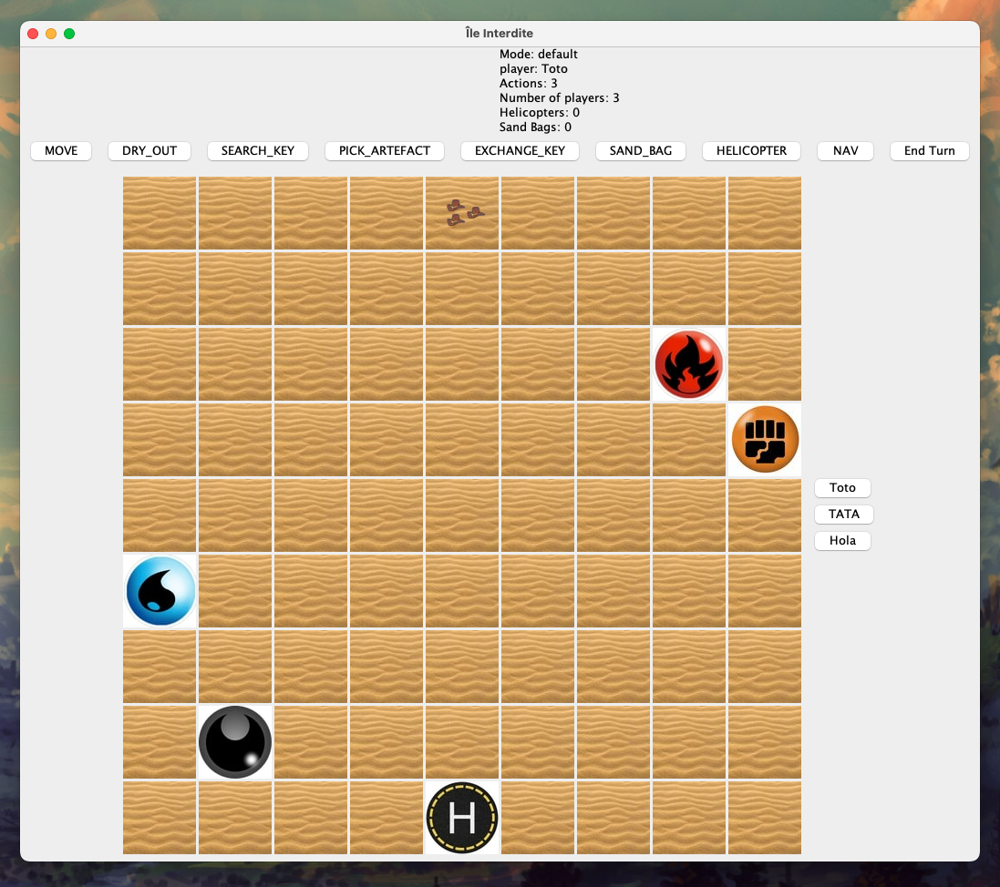

# Projet Île interdite

Nous avons essayé d'adopter une approche fonctionnelle dans la réalisation de ce jeu.
Nous avons tout d'abord réalisé des esquisses du diagramme de classe final et réfléchi à comment utiliser les fonctionnalités de Java 8 (la partie fonctionnelle en particulier) pour pouvoir créer un code élegant et respectant la structure Models Views Controlers.

Le package models est celui où vivent les "données" utilisées par Views et Controlers. Views va s'occuper de l'affichage du jeu et prendre en paramètres des fonctions (callbacks) à appliquer dans diverses situations. La logique du code réside principalement dans "controlers".

Pour pouvoir facilement gérer le projet nous avons utilisé gradle qui permet de créer un build facilement reproduisible.

### Fonctionnalités

Au niveau des fonctionnalités du jeu par rapport au sujet tout le projet de base a été implémenté, plusieurs joueurs peuvent jouer ensemble, ils ont les actions de base (assécher, se déplacer et chercher une clef). 
De plus, nous avons décider d'implémenter toutes les sous-classes de joueurs, au niveau du code cela se représente par une classe abstraite Player et puis les sous-classes des joueurs héritent de cette classe et Override les quelques fonctionnalités différentes.
Il y a donc l'explorateur, le pilote, l'ingénieur mais aussi le navigateur qui implique d'implémenter le déplacement d'autres joueurs en dehors de leur tour, ainsi que le messager qui implique de développer l'échange de clefs ainsi que la possibilité d'avoir besoin de plusieurs clefs par artefact.
Les actions spéciales (hélicoptere et sac de sable) sont également implémentées.

### Pistes d'approfondissement

On pourrait en continuant ce projet passer sur un systeme de paquet de carte qui simulerait encore plus le jeu de base.
Des animations lors de la récupération d'artefacts ainsi qu'une interface plus design sont des pistes posssibles également.

## Jeu

### Interface

## UML

### Diagramme de classe

### Diagramme autogénéré par intelliJ

