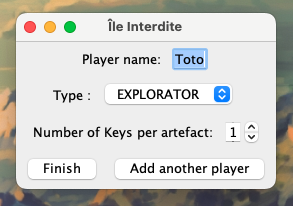

# Projet Île interdite

Nous avons essayé d'adopter une approche fonctionnelle dans la réalisation de ce jeu.
Nous avons tout d'abord réalisé des esquisses du diagramme de classe final et réfléchi à comment utiliser les fonctionnalités de Java 8 (la partie fonctionnelle en particulier) pour pouvoir créer un code élegant et respectant la structure Models Views Controlers.

Le package models est celui où vivent les "données" utilisées par Views et Controlers. Views va s'occuper de l'affichage du jeu et prendre en paramètres des fonctions (callbacks) à appliquer dans diverses situations. La logique du code réside principalement dans "controlers".

## Jeu

### Interface

## UML

### Diagramme de classe

### Diagramme autogénéré par intelliJ

